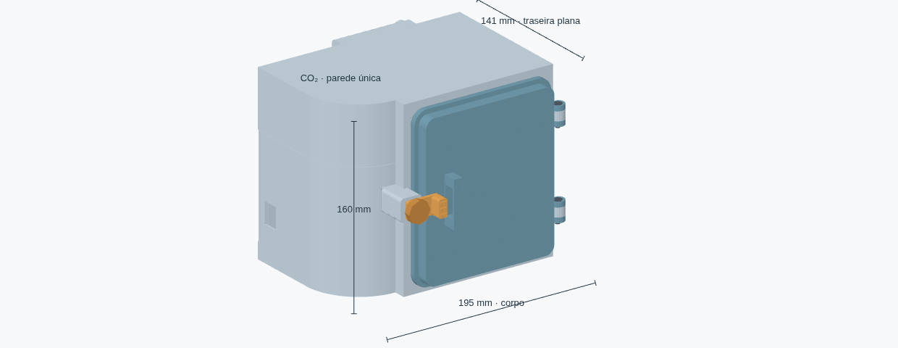
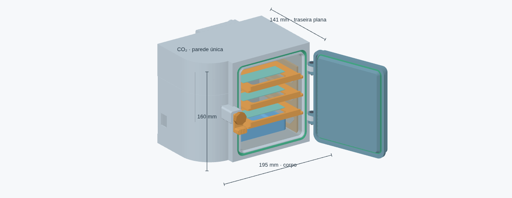
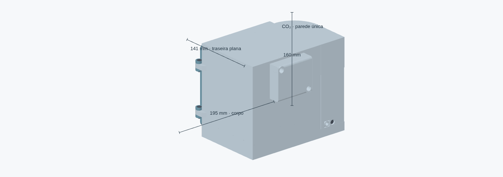
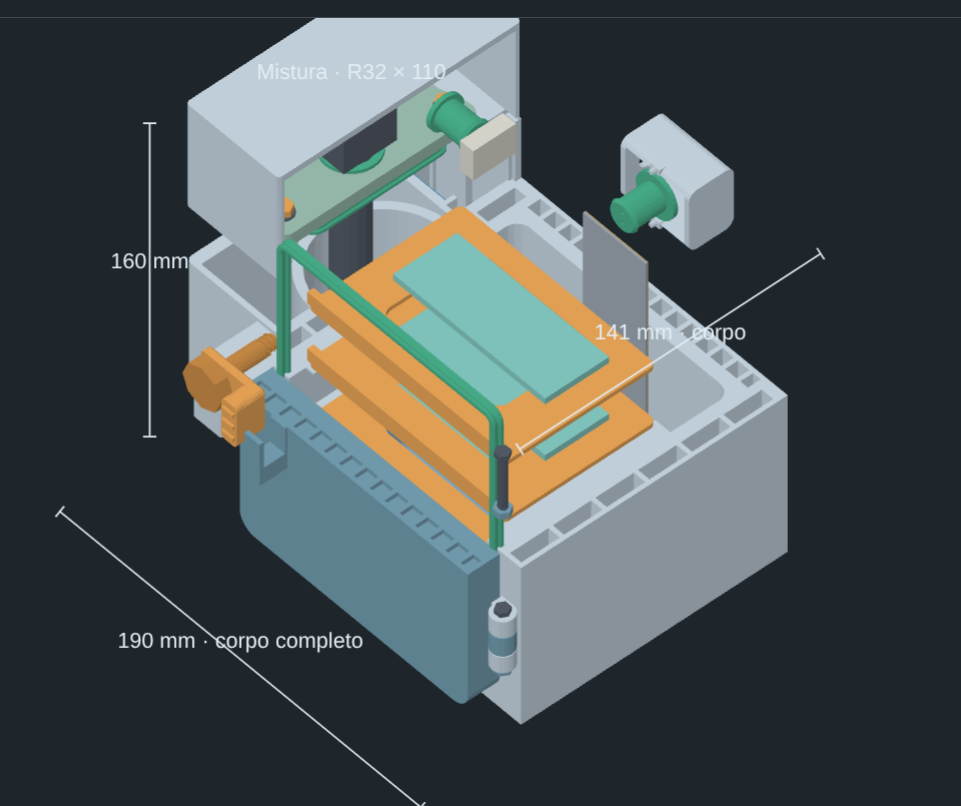
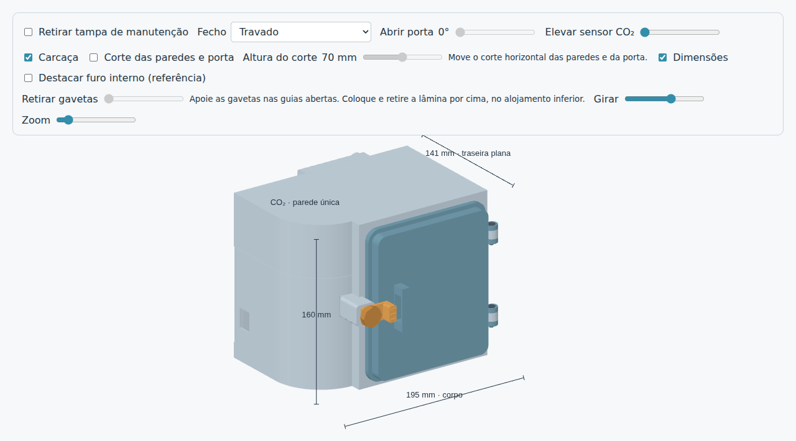

# Mini incubadora CO₂ — v59

Modelo mecânico para impressão 3D, desenvolvido em CadQuery, com porta articulada,
três gavetas removíveis, reservatório de água e compartimentos de CO₂ e eletrônica.
A versão atual completa a rampa a 45° atrás da base da lingueta, incluindo seu lado externo.
As gavetas usam guias abertas e as lâminas são apoiadas somente por baixo.
Vedação, resistência e funcionamento térmico ainda precisam de validação física.



## Arquivos para visualizar e imprimir

- [Visualizador interativo offline](output/visualizador.html): baixe e abra no navegador.
- [Projeto Creality Print 7.2.1](output/incubadora_CrealityPrint_7.2.1.3mf): 36 bandejas, escala 1:1, sem fatiamento ou G-code.
- [Molde e contraforma do inox](output/v59/ferramental_inox/LEIA_ME.md): macho e duas metades de fechamento, com STL e STEP.
- [STL da carcaça com a traseira na mesa](output/v59/impressao_traseira_na_mesa/corpo_integrado.stl).
- [STL, STEP, amostras e relatórios da v59](output/v59/).
- [Conjunto completo em STEP](output/v59/conjunto.step).
- [Situação técnica e pendências](STATUS.md).

O GitHub não executa o HTML: salve o arquivo localmente para usar os controles.
Os arquivos de versões antigas foram removidos da árvore atual; podem ser recuperados pelo histórico do Git.

## Medidas principais

As medidas estão em milímetros. Largura × altura × profundidade para a câmara e o inox.

| Elemento | Medida |
| --- | --- |
| Carcaça na orientação de montagem, largura × profundidade × altura | 195 × 141 × 160 |
| Carcaça com a traseira na mesa, largura × profundidade da mesa × altura de impressão | 195 × 160 × 141 |
| Câmara rígida interna | 112 × 132 × 111; cantos R6 |
| Caixa inox, dimensão externa de referência | 111 × 131 × 110 |
| Caixa inox, dimensão interna de referência | 110,4 × 130,4 × 109,7 |
| Espessura do inox de referência | 0,3 |
| Gavetas, largura × profundidade × espessura da base | 102,2 × 72 × 3 |
| Passo vertical entre gavetas | 29 |
| Alojamento das lâminas | 76,8 × 26,8; rebaixo de 0,6 |
| Caixinha traseira, largura × altura × profundidade | 70 × 60 × 21 |

A caixa inox e o [molde de referência](output/v59/molde_caixa_inox_referencia.stl)
não constituem um plano de corte de chapa: dobras, raios e acabamento precisam ser
conferidos na fabricação. Os furos de referência do inox alinham as passagens de CO₂ e fios.

## Porta, vedação e acesso

A porta é uma peça rígida, com todo o ressalto interno em V de ponta plana.
O ressalto entra no perfil correspondente do corpo. Uma junta TPU labial
fica encaixada nele; a junta TPU do corpo complementa a vedação.
O manípulo central regula a compressão. A estanqueidade depende do ajuste e de ensaio físico.

Para abrir, afrouxe o manípulo e gire a lingueta central 90° para baixo.
A pega lateral é uma dupla hélice circular real, com duas curvas vistas de frente,
hastes cilíndricas Ø3,2 mm e travessas Ø2,2 mm. Os apoios são curvos e se
alargam gradualmente até a porta, com raio de 1,8 a 4 mm.
A hélice tem raio de 6 mm e uma volta completa ao longo de 36 mm;
o envelope com apoios tem altura de 54 mm, profundidade de 15,2 mm e
projeção de 18,6 mm além da placa. Imprimir com a face externa da porta na mesa
e suportes na hélice. Nenhum trecho ultrapassa o plano de apoio da porta.
Os vazados pertencem somente à pega externa: nenhum corte atravessa a porta,
as células de isolamento ou o perímetro de vedação. O canal e as juntas TPU
foram preservados. Ergonomia e estanqueidade dependem de teste físico.
As duas dobradiças usam M4 × 20 escareados, porcas metálicas na porta e buchas de compressão.
Os apoios fixos têm rampas externas a 45° para impressão da carcaça com a traseira na mesa.
Atrás das duas dobradiças e da base da lingueta, as rampas dentro da parede também
fecham a 45°, substituindo os tetos retos sobre as cavidades de isolamento.
A base da lingueta também tem rampa externa, eliminando a face traseira reta que
ainda ficava suspensa. O reforço preserva o volume interno do compartimento de CO₂.



O misturador de CO₂ tem teto integrado, com abertura para o sensor.
A tampa lateral removível dá acesso à eletrônica: solte seu M4 × 12 e retire-a para cima.
A entrada de gás recebe mangueira de silicone Ø externo 6,0 em alojamento Ø6,2,
com boca chanfrada Ø6,8 e profundidade de encaixe de 12 mm.
O canal interno de comunicação com a câmara e o furo correspondente no inox têm Ø6,2.
A folga diametral nominal é de 0,2 mm; conferir encaixe e vedação nas amostras OD6.
O canal não bloqueia retorno de umidade.

## Gavetas e lâminas

O suporte removível tem laterais reforçadas e apoios de 6 mm de largura.
As gavetas entram pela frente em guias abertas, com chanfro de entrada de 2 mm
e folga lateral de 0,8 mm por lado. Apoie a gaveta nos dois trilhos e deslize até o batente traseiro.
Não há tampa superior do trilho nem encaixe estreito para alinhar.
Para retirar completamente, puxe a gaveta segurando-a quando ela deixar os apoios.


A lâmina fica num rebaixo de 0,6 mm na própria base. O apoio é somente inferior;
as bordas do rebaixo limitam o deslocamento horizontal. Coloque e retire a lâmina
por cima. Não há presilhas, lingueta ou material sobre sua área.
O alojamento aberto permite levantar a lâmina e não a retém se a gaveta for invertida.

O desenho foi conferido para lâminas de 76 × 26 e 75 × 25, com espessuras de 0,9 a 1,2.
A referência visual mede 76 × 26 × 1. A área central da gaveta permanece vazada.


## Caixinha traseira e passagens

A caixinha de 70 × 60 × 21 acomoda a sobra dos fios e tem conector lateral Ø8.
As bordas superior e inferior que tocam a incubadora são retas.
A fixação usa dois M4 × 12, com aproximadamente 4 mm de engate no corpo.
Os pilotos são cegos, dentro de apoios maciços Ø16: há 5,6 mm de material atrás
do piloto e 6,25 mm nas laterais. A parede quente de 4 mm permanece contínua sob os apoios.

As passagens de fios usam buchas TPU. Montagem dos fios, compressão das buchas,
retenção dos parafusos e vedação precisam ser conferidas com os componentes reais.
Teste primeiro a [amostra da fixação M4](output/v59/amostra_caixinha_fixacao_M4.stl).



## Impressão

A orientação da **carcaça** é com a traseira apoiada na mesa.
Use o STL indicado acima ou a bandeja da carcaça no projeto Creality Print.
A camada de isolamento tem 23 cavidades alongadas, faces de 2 mm e fechamento a 45°,
com ponte final nominal de 0,4 mm. A parede da câmara tem 4 mm.
Os furos e as fixações mantêm reforços locais maciços.



Materiais previstos no desenho: PC para peças rígidas, TPU 95A para vedações e
inox de 0,3 mm para o revestimento. O 3MF referencia os perfis genéricos
PC/TPU e o processo padrão da K1C com bico de 0,4 mm, sem configurações
personalizadas de filamento ou velocidades por peça. Selecione sua configuração
padrão no Creality Print e ajuste a temperatura conforme o filamento utilizado.
As juntas estão atribuídas ao TPU; imprima cada bandeja com o material correspondente.
O projeto não contém um processo de impressão validado.
STL e STEP contêm geometria; as configurações ficam no projeto 3MF.

Antes de imprimir, confira na prévia de camadas:

- Ausência de suporte preso dentro das cavidades fechadas da carcaça.
- Perímetros e continuidade de material ao redor de furos e vedações.
- Pontes, encaixes, roscas e pequenos detalhes com os parâmetros escolhidos.
- Orientação da porta: ainda não foi definida nem validada.

O suporte das gavetas foi desenhado para a traseira na mesa; as janelas fecham a 45°.
As gavetas têm base plana. As orientações das demais peças no projeto devem ser revisadas.
Imprima as amostras de encaixe e vedação antes de comprometer a carcaça inteira.

## Visualizador



- Arraste o modelo para girar e use **Zoom** para aproximar.
- Selecione **Fecho → Afrouxado e girado 90°** para abrir a porta.
- A retirada das gavetas é liberada no visualizador a partir de 90° de abertura.
- Use **Corte das paredes e porta** e **Altura do corte** para inspecionar as cavidades.
- Em **Peças**, marque componentes ou use **Isolar**.

Os controles mostram a geometria; não substituem testes físicos.

## Gerar os arquivos

Na pasta do repositório:

```bash
python3 -m venv .venv
.venv/bin/python -m pip install -r requirements.txt
.venv/bin/python cad/model.py
.venv/bin/python cad/check_k1c.py
.venv/bin/python cad/build_viewer.py
.venv/bin/python cad/build_creality_project.py --version v59
.venv/bin/python cad/check_creality_project.py --version v59
```

O gerador confere sólidos, interferências e movimentos específicos da porta,
gavetas e lâminas. Os testes adicionais de movimento/roscas são opcionais:

```bash
.venv/bin/python cad/model.py --check-movements
```

Para servir o visualizador na rede local:

```bash
mkdir -p /tmp/incubadora3d-viewer
cp output/visualizador.html /tmp/incubadora3d-viewer/index.html
python3 -m http.server 8081 --bind 0.0.0.0 --directory /tmp/incubadora3d-viewer
```

Acesse `http://IP_DO_SERVIDOR:8081/` com a porta acessível na rede.

## Validação disponível

A v59 passou em 60 pares rígidos sem colisões. O projeto contém 36 bandejas em escala 1:1;
as malhas cabem na K1C com margem de 5 mm. A leitura nativa do Creality Print 7.2.1
terminou com 36 malhas manifold. Gavetas foram conferidas em sete posições de extração;
a área acima das lâminas está livre em um envelope vertical contínuo de 40 mm.

Relatórios: [tetos dos apoios](output/v59/internal_mount_roof_report.json),
[geometria e colisões](output/v59/clash_report.json),
[gavetas e lâminas](output/v59/tray_retention_report.json) e
[projeto Creality](output/v59/projeto_creality_verificacao.json).
Não há fatiamento, ensaio de estanqueidade ou validação operacional.
