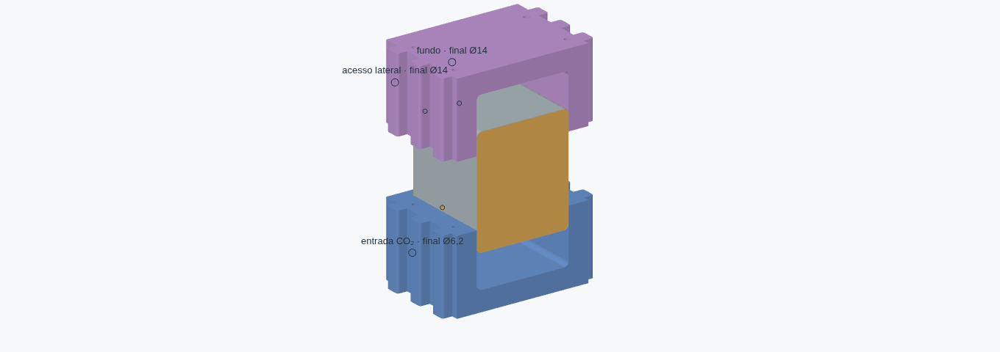

# Molde e contraforma para inox de 0,3 mm

O macho reproduz o interior do revestimento existente e é maciço no CAD.
As contraformas têm paredes de 24 mm, nervuras externas de 12 mm e fechamento
traseiro de 12 mm para apoiar o fundo e travar as laterais. As duas contraformas
fecham por cima e por baixo dele, apoiando os quatro cantos longitudinais.
A cavidade reserva 0,3 mm para a chapa e mais 0,15 mm por face para ajuste.
Raio do macho: 5,2 mm; raio da cavidade: 5,65 mm; comprimento útil: 109,7 mm.

## Arquivos para imprimir

- [Molde interno — macho](molde_caixa_inox_referencia.stl).
- [Contraforma inferior](contraforma_inox_inferior.stl).
- [Contraforma superior](contraforma_inox_superior.stl).

Há um STEP de cada peça nesta pasta para usinagem ou ajustes.
Os STL já estão com uma extremidade plana na mesa, Z mínimo zero.
As três peças cabem individualmente na K1C com margem de 5 mm.
O projeto completo `output/incubadora_CrealityPrint_7.2.1.3mf` inclui todas
as ferramentas: macho na bandeja 10, contraforma inferior na 35 e superior na 36.
As duas últimas compartilham espaço com amostras pequenas de PC, sem sobreposição.
O projeto possui 38 peças em 36 bandejas.
A escolha de paredes, preenchimento e material deve considerar o esforço aplicado;
a resistência das ferramentas impressas ainda não foi ensaiada.

## Uso

1. Pré-dobre as laterais da chapa ao redor do macho. O ferramental serve para
   acertar as dobras e os raios de uma chapa já pré-formada.
2. Apoie a contraforma inferior numa placa plana e rígida. Coloque o macho
   com o inox dentro dela e encaixe a contraforma superior.
3. Alinhe os quatro furos Ø6,6 mm. Eles aceitam hastes ou parafusos M6;
   a distância total entre faces externas fechadas é 179,3 mm.
   Se usar parafusos, reserve comprimento adicional para placas, arruelas e porcas.
4. Distribua o aperto com outra placa rígida por cima e feche gradualmente,
   alternando os lados. As faces de encontro das contraformas limitam o fechamento.
5. Abra as metades e retire o macho pela frente. Faça primeiro um ensaio com
   retalho do mesmo inox para avaliar acabamento, folga e retorno elástico.

## Marcação e furação do inox

As guias passantes da contraforma têm Ø2,5 mm. No macho, os mesmos eixos têm
pilotos cegos Ø2,5 × 3 mm. Use-os com o ferramental **fechado**, para marcar
ou iniciar os furos sem deslocar a chapa. Retire a chapa para ampliar ao diâmetro
final e remover rebarbas; não perfure o macho além dos pilotos cegos.

| Furo | Centro no CAD (mm) | Direção | Diâmetro final |
| --- | --- | --- | --- |
| Entrada CO₂ | X=4,5; Y=60; Z=34 | lateral, eixo X | 6,2 mm |
| Acesso lateral | X=4,5; Y=90; Z=127,5 | lateral, eixo X | 14 mm |
| Acesso traseiro | X=60; Y=110; Z=116 | fundo, eixo Y | 14 mm |

Os centros correspondem às três aberturas do revestimento atual. Os furos
Ø6,6 mm das abas são de alinhamento M6 e não são furos a transferir ao inox.

O conjunto conforma as quatro dobras ao longo da profundidade da caixa.
**O fundo, os recortes e as emendas não são formados por essas peças.**
O revestimento CAD continua sendo uma referência de montagem, não um desenho
planificado de corte e solda. A folga adicional não foi compensada por simulação
de retorno elástico, nem foi calculada uma força de prensa.

## Visualizador

Abra [visualizador.html](../../visualizador.html) e escolha
**Visualizar → Molde e contraforma do inox**. O controle **Abrir contraforma**
afasta cada metade de 0 a 80 mm. Na lista de peças é possível ocultar o macho,
o inox ou cada metade para inspecionar o encaixe. A opção **Destacar centros
dos furos no ferramental** mostra as posições e os diâmetros finais no inox.

## Regeneração e verificações

Execute `python cad/forming_tools.py` no ambiente com CadQuery e depois
`python cad/build_viewer.py`. O gerador principal `cad/model.py` também exporta
o ferramental. `python cad/pack_forming_tools.py` atualiza o ferramental
no 3MF salvo pelo usuário, preservando suas configurações. Execute
`python cad/check_complete_project.py` para verificar esse arquivo.
[verificacao.json](verificacao.json) registra os limites e as
verificações de sólidos, interferências e abertura.
